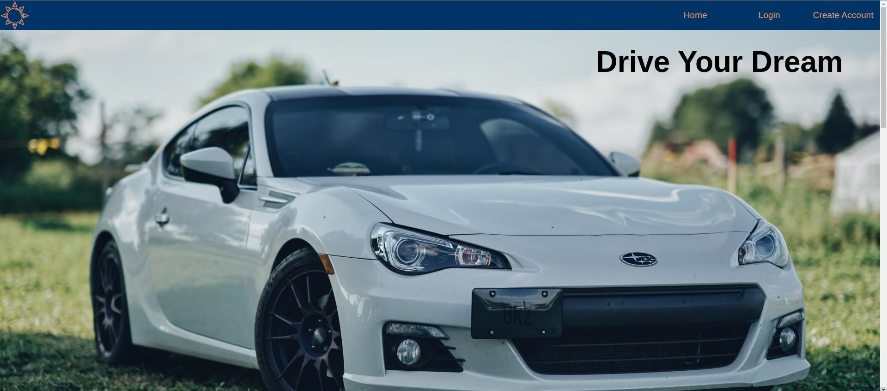

# About this App
CarSale app lets you buy cars from other users and sell your own cars!

# Link to Site
http://34.148.248.82:3000/

- hosted on GCP(Google Cloud Platform) using e2-medium machine vm instance

## Architecture:
- React as front-end
- Java Spring Boot as back-end api
    - REST api
    - Basic Spring Security Authentication 
    - JWT Token and Oauth for authentication and Authorization
    - Authenticates and authorizes users based on user details obtained from mysql database.
    - JPA and hibernate to send SQL queries to database in response to user interaction
    - Datasource setup in application.properties file depending on localhost machine or docker container
- MySQL for relational database
    - Use mySQL CLI or mysql workbench to access database manually and check to see if data entries are being properly implemented

## Features:
- Add car to the site by providing the brand, type, color, and age of said car
- Update car when needed in case you've made a mistake
- List car for sale so that other users can buy it
- Buy cars from other users and grow your list of cars

# Future Features to be Added
- Change password encoder in spring boot api from NoOpPasswordEncoder to BCryptPasswordEncoder and figure out how to implement this given that all user details are stored in mysql database. Need to figure out where and how to decode the password for Spring Security to authenticate and authorize the user.

- Change login page from basic to form login in spring boot so that the user doesn't have access to their information after logging in and logging out in the same session. For example, the user can login, logout, then type in a random username/password and still be granted access to their information based on their first login. 
    - fixed on 10/22/2023, kept httpBasic but logout button works now

- Add JWT and/or OAuth Authorization for extra security in spring boot.
    - fixed on 10/22/2023, added JWT authorization
- Convert the hex color value in the "update-car" page on front-end to show color names using the color hex values stored in the database. Use hex color code to tint the image of car to add individuality.
    - fixed on 10/28/2023, color in card now has square next to it with color(implementing tint on an image seems complicated for what would ultimately be an ugly feature)

- Add ADMIN users and give them ADMIN priviledges to see what cars all users have
- Use CSS to make website presentable
- Add money system to add value to cars and simulate real-life car-sale website.

# General Problems - fixed on 10/28/2023, improved site styling
- Header too tall, needs to be shorter 
- Make Header buttons smaller
- Need Logo or Website name on top left
- Make "Logged in as x" smaller/less intrusive
- Need to add Footer
- Make elements mobile friendly (Especially '/home' and '/my-cars' pages)
- Buttons and image of car too big in cards. The information can look better and be better arranged.

# Updates

### 10/15/2023
- Dockerfile has been created and a snapshot.jar file of the Spring Boot API has also been made so that a docker image can be created.
- Docker image for mysql database and spring boot api has been created. 
- used video for reference: https://www.youtube.com/watch?v=S2s28PCg4M4
- Docker containers using above docker images have been run after numerous attempts and fixes to docker images and were successful. 
- Have checked that an initial user with username: "sam" and password: "man" gets added to the database by going into the docker container for mysql using command "docker exec -it <mysql container name> -uroot -p<Password>", selecting database by using command "use pesanth" and seeing what entries are in the user_details table with "select * from user_details;". Might change 

### 10/17/2023
- pushed react image onto google cloud run - gcr.io/carsaleapplication/react-frontend-car-sale
- react image successfully ran on google cloud run and was able to be accessed through internet, but cloud run is not viable for
a full-stack application. Need to do more research and probably use a gcp vm or multiple vm instances to host front-end, back-end
and database.
- Changed cars on homepage to be generated in div "cards" instead of table elements. Much easier to style with css this way. Website as a whole needs to be styled and made presentable - might use css website template for this.

### 10/20/2023
- Successfully hosted website on GCP(Google Cloud Platform)! (http://34.148.248.82:3000)
- Used docker, dockerhub, and docker compose to build images of frontend and backend and upload onto dockerhub.
- Used docker pull in the GCP vm instance to pull images from dockerhub and docker compose to configure the containers they would run on. The mysql container needed 'MYSQL_ROOT_HOST' environment variable in order for the springboot backend to successfuly establish a connection 
- Spent almost 7 hours yesterday trying to debug why the react app from local computer (i.e. localhost:3000) could communicate with springboot backend, but the react app hosted on the GCP vm (i.e. 34.148.248.82:3000) couldn't. The console would only show a simple "NETWOR_ERROR" that axios threw instead of the actual problem, which was CORS. 

I only found out about this after accessing the GCP vm react app on firefox and the console gave a more detailed "CORS" error which also showed in the network tab in dev tools. After this, I went to the network tab in chrome devtools and indeed, the basic-auth springboot api call was having a CORS error. I assumed that it was some sort of connection error between either the dockker containers which the front-end and back-end where running on the GCP vm or the firewall on the VPC network of the GCP vm, but it was just a simple "CORS" error. I just had to change the "AllowedOrigins" in the Security Configuration in the Spring Boot backend parameter to "*" instead of "hhttp://localhost:3000"(I tried setting it to "http://34.148.248.82:3000", but the same error came back so I have allowed all origins to access it for now) 

### 10/21/2023
- Added background images made on haikei(https://haikei.app/)
- Added styling to form elements and divs
- Changed "my-cars" page to match "home" page styling with cars being inside of "cards" instead of a table 
- Added Redirect Route with path "*" and element "LoginComponent" so that all invalid URLs are redirected to login component
- Cleaned up react warning errors such as using "==" instead of "==="

### 10/22/2023
- Fix login authentication with a try/catch block instead of a messy .then().catch() promise so that the login function in AuthProvider actually returns a value instead of undefined.
- Use said value to display different error messages depending on server response
- used this video(https://www.youtube.com/watch?v=X3qyxo_UTR4) for reference.

### 10/23/2023
- Style form inputs so that the color fits with the website's theme of dark and light blue
- Add css grid to the "/home" page and "my-cars" page
- Make the car "cards" look more appealing by adding background color to the car details and making the labels bold
- Revert "===" back to "==" for the "buy" button in "/home" page because the car's seller wasn't being recognized and the "buy" button was not changing to a "unlist". Also change both car's seller and current user to lowercase before comparing.

### 10/28/2023
- Remove border-radius for a cleaner look
- Remove labels in initial "login" and "create-account" forms and replace with placeholders
- Let inputs and buttons in "login" and "create-account" forms take full width of the form
- Let buttons in "car-cards" take full height of the card
- Add website name to left side of header
- Add error messages to "create-account" page by placing function to call api in AuthContext instead of "create-account" component
- Change style of error messages by adding light red background and red border to look more appealing
- "User create success" message now green
- removed labels from "add car" form and added placeholder to age input
- color in "car card" now has square next to it with color from hex value in database(which user chose when adding car)
- deploy v2 front-end to GCP vm

### 10/31/2023
- Add logo to header and Login/Create-Account pages
- Added admin user with role "ROLE_ADMIN who has access to all users(can delete them from react front-end) to data.sql file. Means that by default, there will be a user with admin access which can be accessed.
    - Still need to implement in front-end
- Changed px to rem for sizing fonts and elements for better mobile experience
- Replaced Background Images for Header and Footer with Logo Colors and changed colors of website fonts to be more aesthetically pleasing 

### 11/05/2023
- Fix generated value for user ids incrementing by 50 when created. Had to create a table generator for User class with allocationSize of 1 and set the GeneratedValue strategy to GenerationType.TABLE and set generator to the aforementioned table generator.
- Don't allow creation of duplicate users by checking if user exists before saving in userRepository. Also return HttpResponse of 409 if user already exists. I really like returning specific http status codes for different circumstances. Will change all controller methods to return http status codes manually.

### 11/15/2023
- Put background images in login and create-account page. 
- Offset the login/create-account form and lower opacity a bit.
- Add home page with reviews, sponsors, and some miscellaneous information

### 11/19/2023
- Add JWT token and Oauth2 to Car Sale Application
    - use https://www.youtube.com/watch?v=KYNR5js2cXE for reference to implement jwt tokens in the backend

### 11/22/2023
- Add infinite horizontal scroll via css to cars on homepage
    - use https://www.youtube.com/watch?v=nAjR0Oj0J8E&t=413s for reference
- Add one more review to homepage

### 11/26/2023
- Move reviews to json file and map through them to take up less space in home component. Maybe do the same with the svg images somehow
- Add and implement price to car
- add info icon in login page that lets you know to login as admin to have access to users
- Deploy V4 of Car Sale Application to GCP

# Initial Sketches:

# Website Versions:

### V2

### V3 - 11/15/2023

### V4 - 11/26/2023
